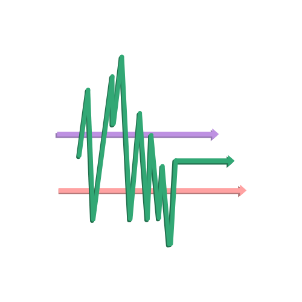

<div align="center">
  
</div>

# Sensor Stream - A native Android sensor data collector using NDK (C++) [Privacy Policy](https://maxschlake.github.io/sensor-stream/privacy-policy)

## Overview
The project involves building a native Android application that collects sensor data (e.g., Accelerometer, Gyroscope, Magnetometer) from an Android smartphone using C++ with the Android Native Development Kit (NDK). The data is streamed to an external system over a network connection for further analysis. <br/>

**Sensor Stream** is designed to minimize Java/Kotlin dependencies, with the majority of the functionalities (sensor access, data processing, and network communication) implemented natively in C++. It is a follow-up project for my Master thesis paper about Human Activity Recognition (HAR), where said sensor data is fed into a modified transformer model to identify human movements (like running, jumping, etc.). Upon publication of that paper, I will also make the code for the transformer available here.

## Highlights
- Native C++ development core functionality, including data collection and networking
- Development and publication of the **Sensor Stream** app: A simple and effective application to conduct sensor-based HAR experiments
- Live sensor data handling: Sensor data is captured in real-time, displayed on the UI, and streamed to a (password-secured) server
- Network communication via TCP sockets
- Minimal Java/Kotlin usage: Java is used for initializing the UI and binding the C++ library

## How to use Sensor Stream
### 1.) Download the Sensor Stream app
The app is available on Google Play and runs on Android XXX upwards.
### 2.) Open the Sensor Stream app
The app immediately displays live data from your phone's accelerometer, gyroscope and magnetometer.
### 3.) Start the server
Open the command line, navigate to the project folder, and run `python server.py`. The script will establish a TCP socket and lets you set up a new password for every session. <br/>
By default, it uses your local IPv4 address and port 8080. However, both IP address (for example: '192.168.1.2') and port number (for example: 8081) can also be entered manually, as shown below: <br/>
```
python server.py --ip '192.168.1.2' --port 8081
```
### 4.) Start sending data from your phone to the server
Return to the app and click *START SENDING DATA*. The app then lets you choose the duration of the stream (in seconds). Once you have entered the correct password, the data transmission starts.
### 5.) Access the recorded data
Data by sensor is stored in separate CSV files in the *raw* folder.
